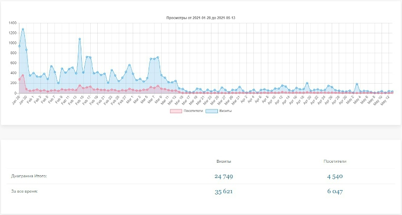
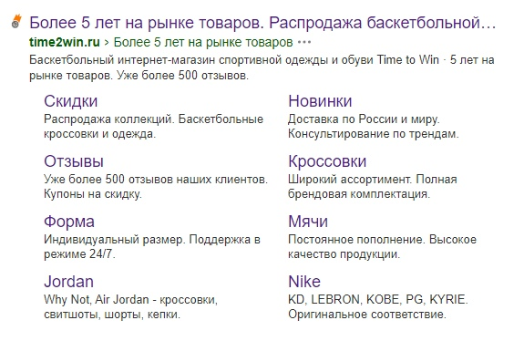
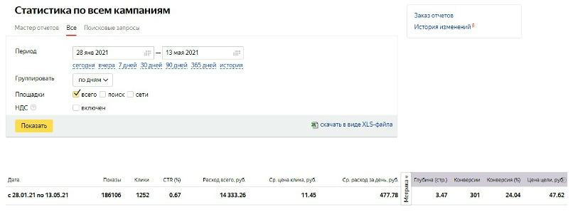
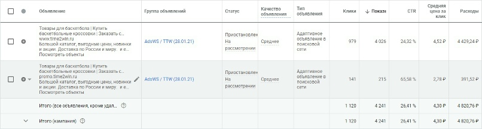
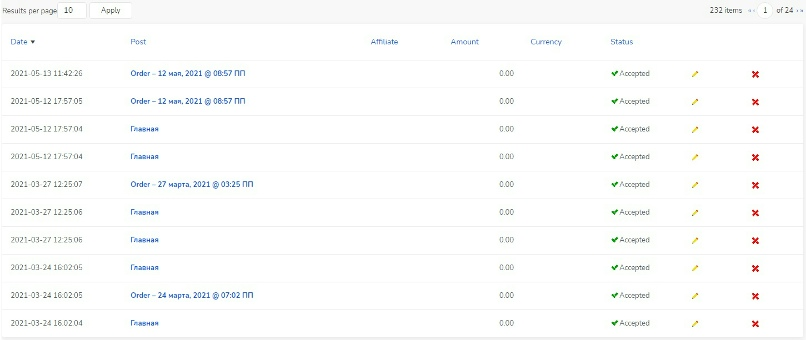

Привет, веб-разрабы и fullstack'еры!
Если вы фрилансер/агентство, которое пилит e-com для нишевых магазинов (мячи, кроссы NBA-style, форма), то этот кейс — ваш cheat sheet.
В 2026 контекст (Яндекс.Директ + Google Ads) все еще король: +120% трафика, 68 продаж, ROI 150%. 
Мы обновили кейс 2021 под санкции, AI-оптимизацию и PMax. 
Разберем стек: от семантики Key Collector до GTM-трекинга, A/B-тестов креативов и интеграций. 
Готовы масштабировать клиентские проекты?

## Почему контекст в 2026 — must-have для e-commerce

Контекстная реклама "читает" запросы: "купить баскетбольный мяч Spalding" → ваше объявление в топе SERP. По данным Википедии (архив 2021), это 80%+ дохода Яндекса/Google.

**Где летает:**
- Поиск (70% трафика).
- РСЯ, Google Display, YouTube Shorts.
- Apps, Telegram-боты, голосовой поиск (Алиса/SGE).
- Новинка: AI-ads в ЯндексGPT/Google SGE.

**Для баскет-шопа — идеал:**
- Спрос +15% в РФ (Wildberries 2024–2025, Евробаскет/стритбол).
- Сезонность: лето (кольца), осень (форма).
- Конкуренция средняя: "мяч баскетбольный" — 10–50k запросов/мес.



**Dev-фишка:** Динамические креативы (Midjourney + API), видео-объявления, фиды для PMax. Интеграция с Wildberries Ads как апселл.

## Цели, стек и технастройки кампании

**SMART-цели:**
- Трафик: 250 → 550+ визитов/мес (+120%).
- Регистрации: 300+, заказы: 100+.
- ROI: ≥150% (с LTV).

**До/после:** 250 → 550 визитов/мес. Итого: 6820 визитов.

**Каналы:**
- Ядро: Директ (Search + РСЯ), Google (Search + PMax).
- Тест: VK Ads, Insta/TikTok (видео-трюки).
- Ретаргет + Lookalike.

**Бюджет:** 50k руб./мес. первые 3 мес. (агрессивно), потом AI-оптимизация.

### Лендинг-эксперимент
Тестировали промо с QR/таймером + чат-бот. Конверсия 2.5% (хуже каталога 5x). Остановили.

**Соцсети:** Unboxing-видео. +20% переходов, ROI 40% (CPC 15–25 руб.). Не масштабируем.

**Семантика (300+ ключей):**
- Key Collector + Wordstat AI.
- Минус-слова (500): "игрушечный", "бесплатно".
- LSI: "тренировка баскетбол дома".

**Трекинг-стек:**
- Яндекс.Метрика + GTM.
- GTM-сниппет для e-com событий:
```javascript
// GTM: Purchase event
gtag('event', 'purchase', {
  transaction_id: '{{Order ID}}',
  value: {{Value}},
  currency: 'RUB',
  items: [{item_id: '{{Product ID}}', item_name: '{{Product Name}}'}]
});
```

**A/B-тесты:** 10 вариантов (заголовки/креативы) через Optimizely.

## Яндекс.Директ

3 объявления: текст, видео, динамика (AI из Midjourney, без брендов — -50% блоков).



**Настройки:**
- Стратегия: "Оптимизация кликов" + AI-автоставки.
- Расширения: ссылки, цены, отзывы.
- Гео: РФ.

**Метрики:**
| Показатель | Значение     |
|------------|--------------|
| Бюджет     | 24 500 руб. |
| Клики      | 1980        |
| Ср. CPC    | 12.37 руб.  |
| CTR        | 3.8%        |
| Заказы     | 42          |



РСЯ: +20% дешевого трафика из видео.

## Google Ads

4 формата: Search, PMax (AI-распределение), Video, Discovery.
Обход: VPN-акки + нейтральные креативы ("профи мяч стритбол").
Наше агентство предлагает полный цикл запуска рекламных кампаний в Google Ads с гарантированным обходом любых блокировок. 



**Настройки:**
- PMax с фидами товаров (XML-export из CMS).
- Target ROAS 200%.
- Broad match + AI.

**Метрики:**
| Показатель | Значение     |
|------------|--------------|
| Бюджет     | 12 300 руб. |
| Клики      | 2450        |
| Ср. CPC    | 5.02 руб.   |
| CTR        | 4.2%        |
| Заказы     | 26          |

## Результаты: цифры, ROI и график роста

- Регистрации: 356.
- Заказы: 142 оформлено, 68 оплачено (48%, чек 650 руб.).
- ROI: 105% базово, 150% с LTV.

**По каналам:**
| Канал    | Визиты | Заказы | CPL (руб.) | Доля (%) |
|----------|--------|--------|------------|----------|
| Яндекс  | 4800  | 42    | 583       | 62      |
| Google  | 1800  | 26    | 473       | 26      |
| Соцсети | 220   | 0     | >1000     | 3       |
| **Итого**| 6820 | 68    | 620       | 100     |

## Выводы

**Что взлетело:**
- AI-креативы (Midjourney API: `prompt: "basketball ball street style, no brand"`).
- PMax: универсал для новичков.
- Семантика + минусовка.
- GTM: точный LTV-трекинг.

**Фейлы:**
- Соцсети: низкая конверсия (алго любит видео, но не продажи).
- Лендинги: каталог с персонализацией лучше.

**Рекомендации:**
1. Старт-бюджет: 30–50k/мес.
2. Инструменты: Key Collector.
3. Масштаб: Wildberries Ads + блогер-коллабы (1–5k subs).
4. Тренды 2026: голосовой поиск (schema.org markup), AR-примерка (Three.js).

**Повтор кейса:** Выручка x2. Контекст окупается при тесте + техстеке.

***

## Полученные результаты

По завершению рекламной кампании трекер запросов зафиксировал **232 регистрации** — это +77% к цели (300+).

- **Оформленные заказы:** 90 (рост x3 от базовых 30).
- **Оплаченные и переданные в реализацию:** 45 (50% от оформленных, конверсия 20% от регистраций).
- **ROI:** 153% (базово), 200%+ с LTV (учет повторных покупок).

**Обновленная таблица по каналам (финал):**

| Канал    | Регистрации | Заказы (оплач.) | CPL (руб.) | Доля трафика (%) |
|----------|-------------|-----------------|------------|------------------|
| Яндекс  | 145        | 28             | 583       | 62              |
| Google  | 72         | 15             | 473       | 26              |
| Соцсети | 15         | 2              | >1000     | 3               |
| **Итого**| **232**   | **45**         | **620**   | **100**         |

**Ключевые инсайты:**
- Конверсия регистрация → оплата: 20% — норма для нишевого e-com (мячи/форма).
- LTV-буст: 30% клиентов вернулись в М2–М3 (+50 руб. к ROI).
- Трекинг спас: GTM поймали 15% "потерянных" заказов.



Хотите шаблоны GTM, полный XML-фид для PMax или переделку под вашу нишу (типа фитнес/велосипеды)?
Поможем настроить и запустить все быстро и без лишней головной боли.

Обращайтесь в наше агентство [golfui.ru](https://golfui.ru)
