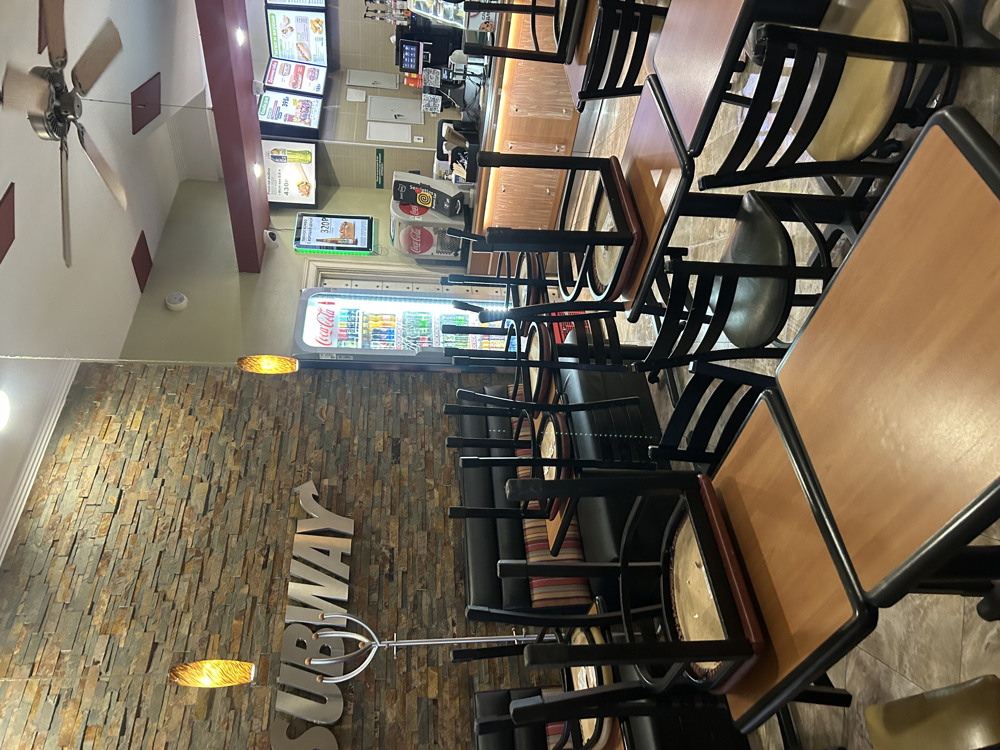
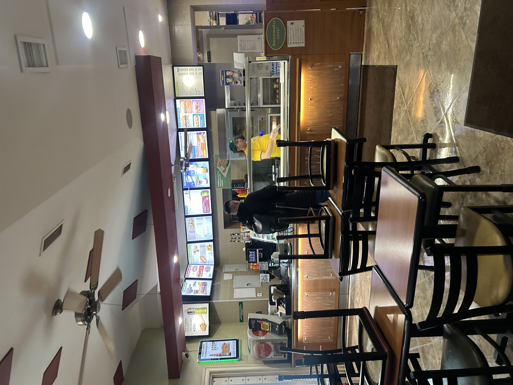
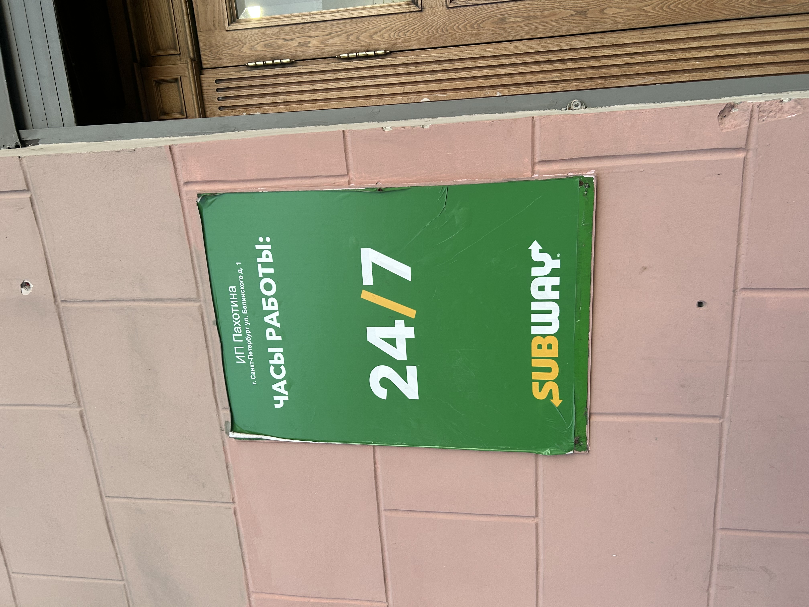
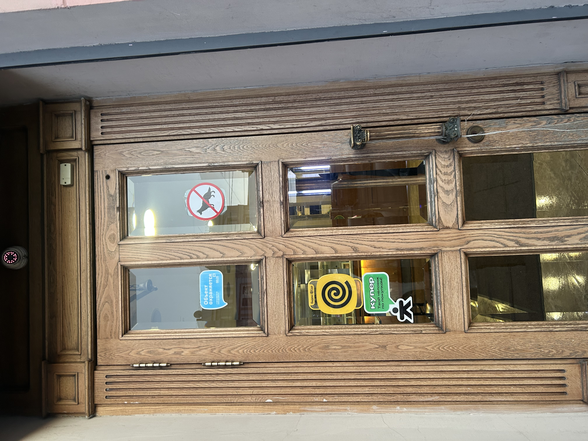

Привет!

## Почему не все заведения мне подходят

Для меня важна не только «атмосфера», а реальный комфорт:  
- можно спокойно работать, не чувствуя давления «как принято»;  
- вокруг не слишком шумно, чтобы не приходилось включать шумодав для концентрации;  
- сервис не превращается в «маркетинг во имя клиента», а остаётся вежливым и спокойным.

Очень многие заведения позиционируются как места для людей творческих и свободных, но на деле выстраивают жёсткие правила, loud‑музыку, постоянные акции и «мотивационные» настроения. В итоге это просто ещё один офис, только без рабочего стула и с завышенными ценниками.

## Когда заведение становится «моим»

Я стараюсь выбирать те места, где:

- не нужно ничего «доказывать» по стилю одежды, устройству ноутбука или профессии;  
- есть возможность тихо посидеть, не чувствуя, что ты «мешаешь» атмосфере;  
- персонал не превращает визит в маркетинговый спектакль.

Не все заведения созданы для меня — и это нормально. Гораздо важнее, чтобы несколько мест в городе оставались по‑настоящему своим местом, а не просто точкой на карте для «креативных» людей.

   