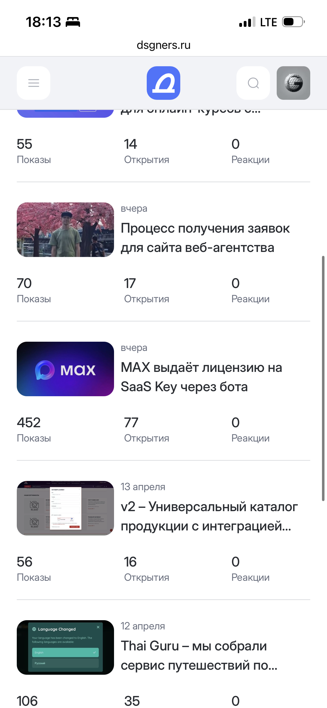
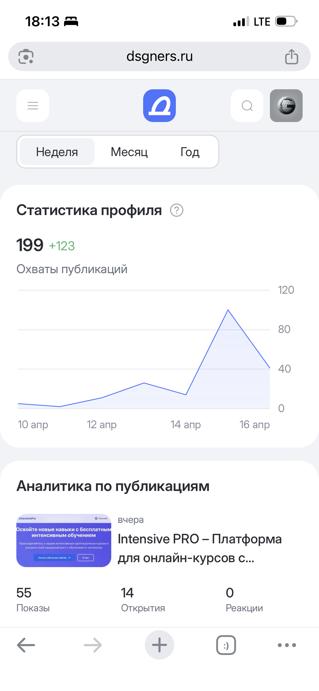
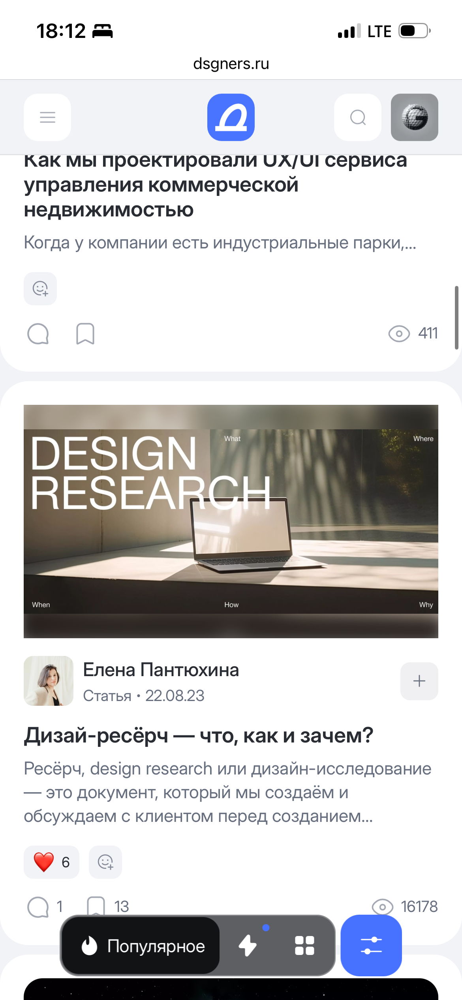
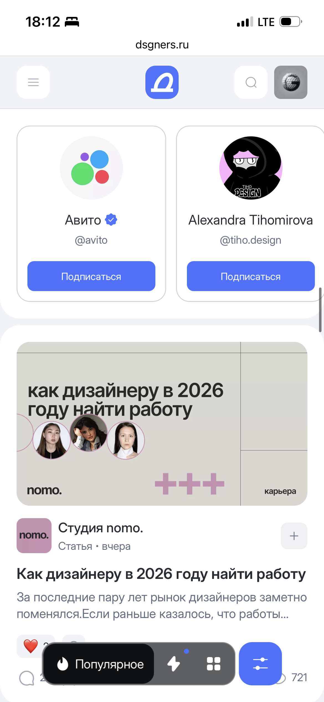
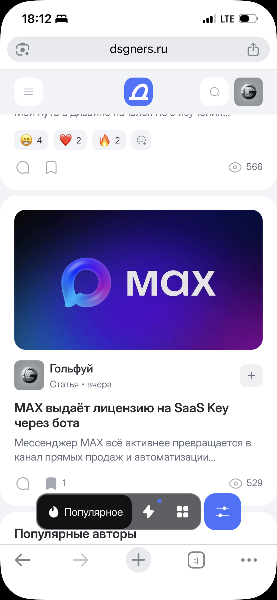
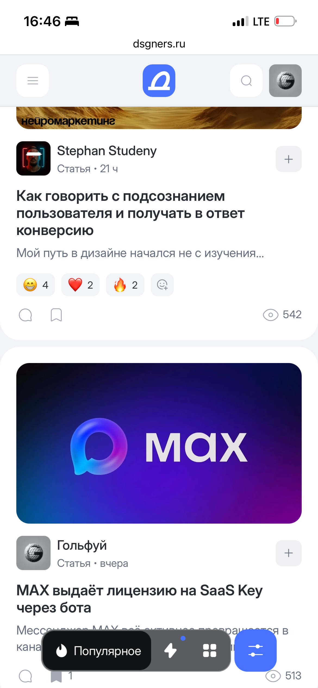

Иногда хорошие публикации попадают на главную вовсе не по заранее выстроенному плану. Так получилось и у меня: материал про то, как MAX выдаёт лицензию на SaaS Key через бота, оказался на главной дизайнерс почти случайно.

Я не могу сказать, что это был тщательно рассчитанный запуск или специально подготовленная виральная история. Скорее, это тот самый случай, когда полезный и понятный материал просто совпал с интересом аудитории и попал в нужное время в нужное место.

## Почему это сработало

Тема оказалась практичной: бот, автоматическая выдача ключа, SaaS и удобный сценарий для пользователя. Всё это легко считывается, потому что решает конкретную задачу — без ручной проверки, лишних сообщений и ожидания.

Мне кажется, именно поэтому публикация зацепила людей. Она не была построена на хайпе, а просто показывала понятную механику: как можно автоматизировать выдачу лицензии и сделать процесс быстрее для клиента и проще для бизнеса.

## Немного статистики

За первые сутки пост собрал около 500 просмотров. Для моего материала это был очень заметный результат, особенно если учитывать, что рядом выходили публикации с примерно такими же цифрами.

То есть это не выглядело как единичный случай или случайный всплеск на фоне пустоты. Скорее, публикация вписалась в общий поток интересных материалов и показала статистику на уровне соседних постов.

## Что я вынес из этого

Главный вывод простой: иногда достаточно сделать полезный материал, а дальше уже срабатывает удачное совпадение времени, темы и интереса аудитории.  
И да, в моём случае это действительно больше похоже на случайность, чем на заранее спланированную кампанию.

Но, пожалуй, в этом и есть ценность: не всегда нужен громкий запуск, чтобы получить внимание. Иногда достаточно точной темы, понятной подачи и чуть-чуть удачи.

     
