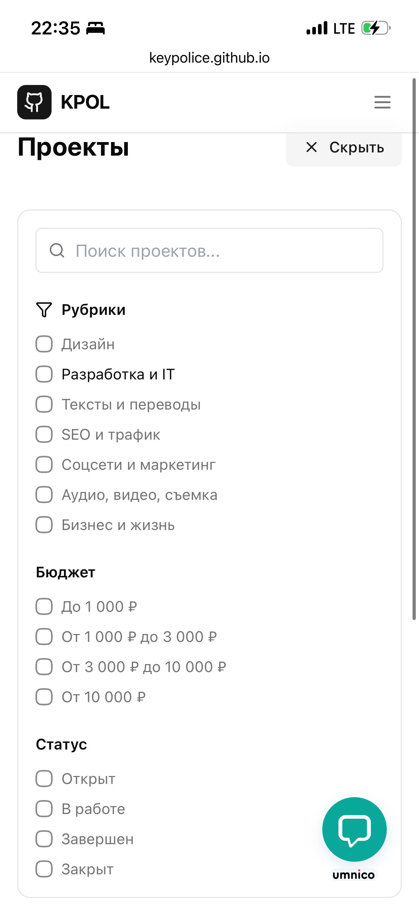
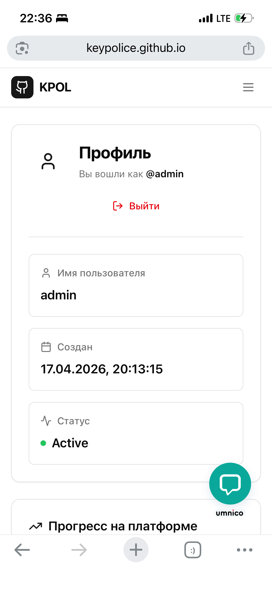
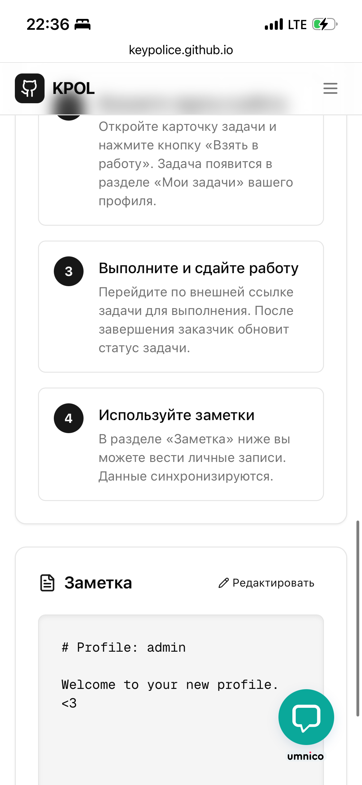

Сегодня расскажу историю **KeyPolice** — сервиса на [keypolice.github.io](https://keypolice.github.io), который я запустил недавно. Это не просто инструмент, а целая файловая система, построенная по принципу "каждая запись — это Markdown-файл". Звучит просто? Потому что так и есть. Давайте разберёмся, как это родилось.

## Почему я это создал

Всё началось около года назад, когда я работал над несколькими проектами для клиентов: админки для агентств, CRM для фрилансеров и даже франчайзинговые шаблоны. Общая боль — базы данных. SQL? Слишком тяжко для прототипов. NoSQL вроде Supabase? Круто, но для маленьких команд или соло-разработчиков это оверкилл: миграции, схемы, масштабирование... Я устал от этого.

Тогда я подумал: "А что если хранить всё в файлах? Markdown — это уже мой родной язык для блогов на Hugo, документации на GitHub и даже контента для SaaS". Идея: превратить репозиторий в полноценную файловую систему. Каждая сущность (пользователь, пост, заказ, партнёр) — отдельный `.md`-файл с YAML-фронтматтером для метаданных. Хочешь редактировать? Открываешь в VS Code. Хочешь версионировать? Git сам всё сделает. Масштаб? Просто кидай файлы в папки.

Так родился KeyPolice. Название — от "key" (ключ/сущность) и "police" (полиция файлов, которая наводит порядок 😎). Первый коммит на GitHub был сегодня 2026-го, а через несколько часов сервис уже живой на keypolice.github.io.

## Как это работает на практике

Представьте структуру:

```
data/
├── users/
│   └── user-123.md  # YAML: id: 123, name: "Семён", email: "..."
├── posts/
│   └── post-456.md  # Контент в Markdown, метаданные в фронтматтере
└── orders/
    └── order-789.md
```

Сервис парсит эти файлы на лету: API-эндпоинты для CRUD (create/read/update/delete), поиск по фронтматтеру, даже валидация схем через JSON Schema в YAML. Интеграции для хостинга — deploy в один клик. Нет баз данных — только Git и Markdown.

**Пример файла `user-123.md`:**
```markdown
---
id: 123
name: Семён Федосеев
email: semen@example.com
role: admin
created: 2026-04-18
---
# Профиль пользователя

Здесь bio в Markdown.
```

Это гениально просто для фриланс-агентств вроде моего: редактируй данные в GitHub, тяни через API в React/Vite-приложение. Масштабируй до тысяч файлов — GitHub Pages справятся.

Вот пример текста для новой секции, который ты можешь добавить на страницу `https://fedoseevsm.github.io/p/keypolice-github-io/` (например, под заголовком `## Как это работает` или `## Безопасность и приватность`):

***

### Фриланс‑платформа без личных данных

<keypolice.github.io> — это фриланс биржа, в которой вся информация о предложениях и сделках хранится в открытом GitHub‑репозитории, а не в отдельной базе данных пользователей.
Никакие подробные личные данные заказчиков и исполнителей не собираются централизованно: вместо этого контент и метаданные публикуются напрямую в ветках и pull requests, что делает систему более прозрачной и децентрализованной.

## Что дальше

KeyPolice уже open-source, с доками и примерами на GitHub. Я добавил чатбот для быстрого старта и шаблоны для типичных сущностей (пользователи, блог-посты, партнёрства).

      
      
      
  