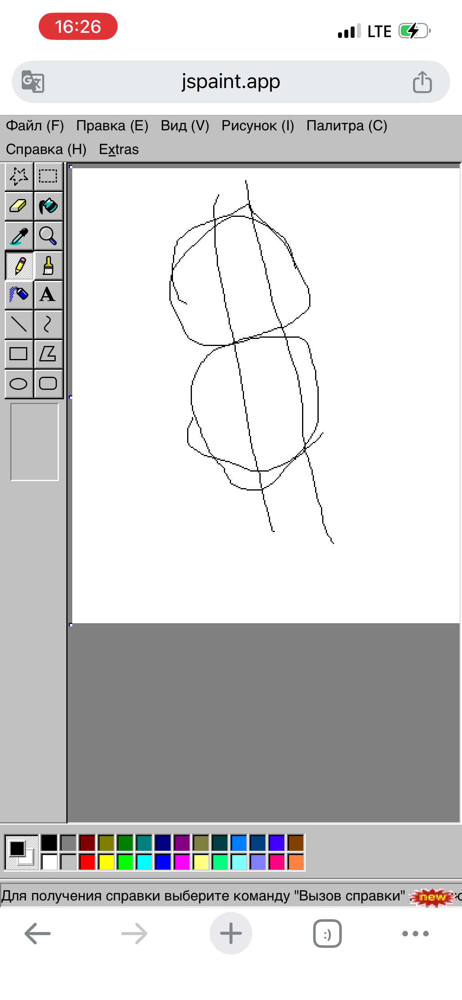
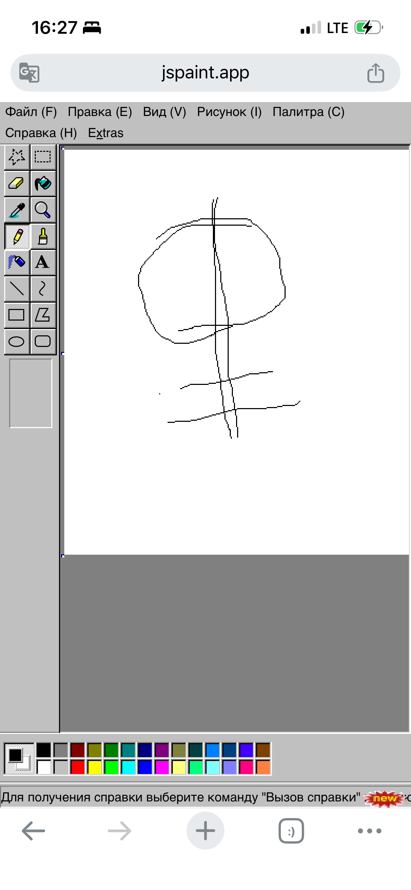
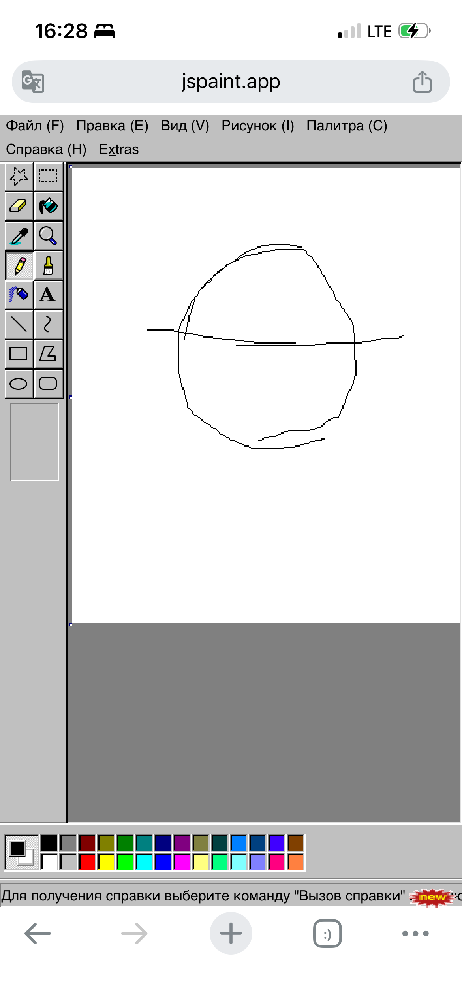

Сегодня 19-е число. Интересно, что при зеркальном отражении получается **1991**.

Это можно воспринимать как символ:  
- возврат к исходной точке  
- момент переосмысления  

И это хорошо ложится на сам принцип Питера.

## Разбор конструкции

Если посмотреть на слово «Питер» чуть внимательнее:
- **Пи (p)** — давление, внешние роли или токсичное влияние  
- **Тера** — террариум, замкнутая среда  

В итоге — человек внутри среды давления.

А если читать иначе:
> **ПИТЕР = ТЕРПИ**

## Почему "терпи" не работает
Постоянное «терпение» без переработки эмоций даёт эффект перегрева:
- накапливается напряжение  
- падает ясность мышления  
- ухудшается состояние  

Как в закрытом террариуме без воздуха.

## ТераПиЯ как выход
Теперь добавим недостающий элемент:

> **ТЕРА + ПИ + Я = ТЕРАПИЯ**

Ключ — **Я**.

Это тот самый момент «разворота» (как 19 → 1991), когда:
- ты начинаешь замечать себя  
- возвращаешь контроль  
- перестаёшь просто терпеть  

## Практика: ежедневная терапия
Терапия — это не только психолог.

Это:
- записать мысли  
- проговорить ситуацию  
- разобрать эмоции  
- дать себе честную обратную связь  

Регулярность важнее формата.

## Среда и воспитание
Среда всегда усиливает поведение.
Поэтому важно не просто адаптироваться, а формировать:
- уважение к себе  
- границы  
- адекватные модели взаимодействия  

Осознанность сильнее, чем терпение.

## Символика 1991
Число **1991** можно рассматривать не только как отражение (19 → 1991), но и как символ переломного момента.

В разных интерпретациях это:
- распад старых систем  
- изменение глобального баланса  
- попытка выйти из внешнего влияния и пересобрать идентичность  

В этом контексте **1991** можно воспринимать как метафору освобождения — в том числе от доминирующих внешних центров силы, таких как США.

Но важно понимать:  
любое «освобождение» — это не финальная точка, а начало этапа, где ответственность переходит внутрь.

## Связка с принципом Питера
Если перенести это на личный уровень:
- внешнее давление всегда будет  
- «терпи» — оставляет зависимость  
- «ТераПиЯ» — это уже внутренняя автономия  

То есть настоящий выход — не в смене внешнего влияния, а в появлении **Я**, которое умеет перерабатывать среду.

И если делать «терапию» регулярно — система перестаёт тебя перегревать.

     