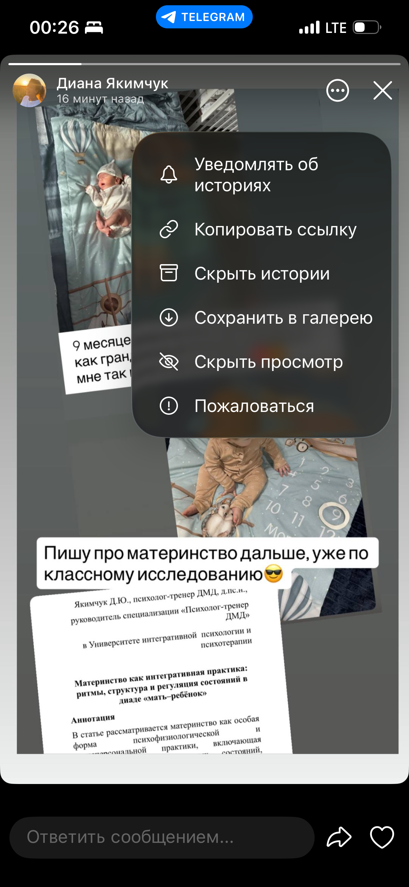

Telegram — один из самых популярных мессенджеров, и многие пользователи считают, что их истории просматриваются относительно безопасно и приватно. Но на практике всё гораздо сложнее, особенно если речь идёт о **спецзаказах** или системах, которые умеют работать через API или обходные пути.

## Как анонимно смотрят ваши сторис

По спецзаказу (разработка бота, скрипта, парсера или интеграции с внешним сервисом) можно организовать просмотр сторис **в фоне**, минуя обычный интерфейс Telegram:

- Вместо того чтобы вы сами открывали сторис, просмотры могут инициироваться через API‑обёртку или сторонний клиент, который работает под вашим аккаунтом.
- В этом случае история всё равно помечается как просмотренная, а вы никак не видите фактического «человека» в списке — это может выглядеть как обычный просмотр с вашего же устройства или через «невидимый» вход.

Такой способ позволяет **анонимно** собирать данные о том, какие сторис вы просматриваете, как часто и в какое время, даже если вы не делаете прямых действий.

## Вход в профиль через API без двойной/тройной авторизации

Если у пользователя **нет двойной (двухфакторной) или тройной авторизации**, риск значительно возрастает:

- API‑клиенты могут авторизоваться по **номеру телефона + коду из SMS**, а иногда — по уже сохранённым сессиям (session files), если доступ к ним получен.
- Через API можно:
  - подключаться к аккаунту и получать доступ к историям (сторис),
  - читать входящие сообщения и метаданные,
  - собирать информацию о том, какие каналы вы подписываетесь, какие сторис вы просматриваете и как часто.
- При этом всё это может происходить **на стороннем сервере**, а вы даже не заметите подозрительных входов, если не проверяете список активных сессий.

Такой вариант входа особенно опасен, потому что злоумышленник или сторонний сервис может делать всё это **в фоне**, без каких‑либо визуальных уведомлений.

## Почему это опасно

Спецзаказ на **тайные просмотры сторис** или **анонимный мониторинг аккаунта** может использоваться:

- для аналитики поведения (путём сбора статистики, на какую аудиторию вы «заходите»),
- для скрытого слежения (например, конкуренты, партнёры, недобросовестные разработчики),
- для сбора персональных предпочтений и дальнейших манипуляций.

Если у вас нет **двухфакторного пароля** или тройной защиты, злоумышленник или сторонний сервис получает почти **полный доступ** к аккаунту через API при первой удачной попытке авторизации.

## Как обезопасить себя

- Включите **двухфакторную авторизацию** (двухэтапный пароль) в настройках Telegram. Это значительно усложнит доступ по API без вашего реального вмешательства.
- Регулярно очищайте **активные сессии** («Настройки → Приватность и безопасность → Активные сессии»).
- Не используйте сомнительные боты‑парсеры, сайты и сервисы, которые требуют логина в Telegram или установки неофициальных клиентов.
- Избегайте скачивания сторонних скриптов или телеграм‑клиентов «под заказ» без проверки их кода и политики конфиденциальности.
- Не оставляйте аккаунт без привязки к надёжному методу восстановления (почта, recovery code).

У Telegram есть мощные механизмы приватности, но **спецзаказы и неофициальные API‑решения** позволяют обходить их. Если вы не используете двойную или тройную авторизацию, ваш аккаунт становится потенциально открыт для **анонимного мониторинга**, включая скрытые просмотры сторис. Убедитесь, что ваша защита на уровне хотя бы минимального рекомендуемого минимума — это значительно снизит риски.

